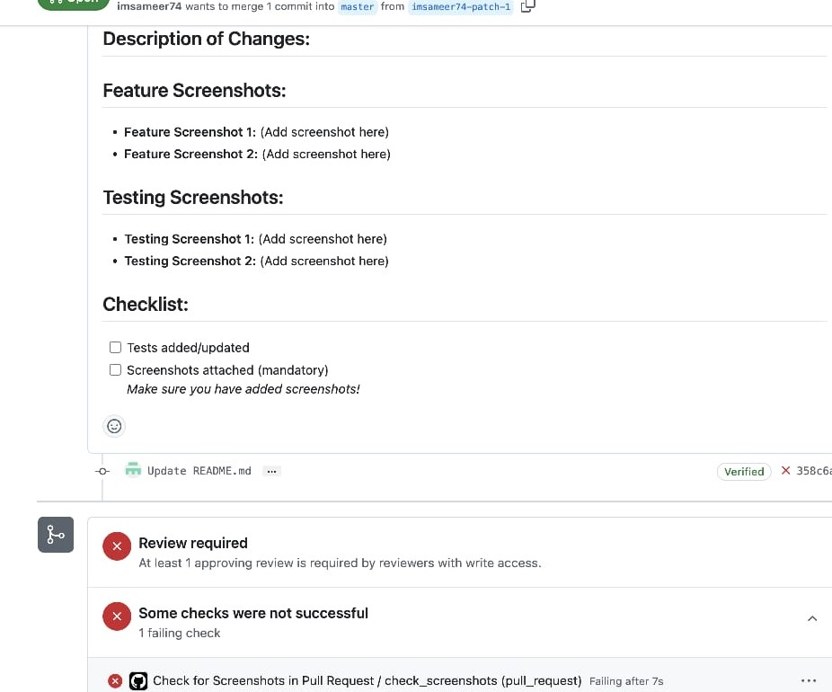

# PR Quality Enforcer 🔍  
_A GitHub Action that enforces screenshots and templates in PRs—scaled across your entire org!_  

  
*(Example: PR check in action)*  

---

## 🚀 **Why Use This?**  
- **Org-wide consistency**: Apply checks to all repos/branches with one ruleset.  
- **No manual setup per repo**: Rulesets automate enforcement.  
- **Customizable**: Target specific branches (e.g., `main`, `prod/*`).  

---

## ⚡ **Setup (Org Admins Only)**  

### 1. Add the Files to Your `.github` Repo  
Copy these to your **organization's `.github` repository**:  
- [`workflows/pr-screenshot-check.yml`](.github/workflows/pr-screenshot-check.yml)  
- [`PULL_REQUEST_TEMPLATE.md`](.github/PULL_REQUEST_TEMPLATE.md)  

### 2. Create an **Org-Wide Ruleset**  
Go to:  
**Org Settings → Rulesets → New Ruleset**  

Configure:  
- **Name**: `Require PR Screenshots`  
- **Target**: Choose branches (e.g., `main`, `feature/*`)  
- **Rules**:  
  - ✅ **Status checks** → Require `pr-screenshot-check` to pass.  
  - ✅ **Pull requests** → Require PR template.  

  

### 3. Done!  
Now, **all PRs** in your org will:  
- Show the template automatically.  
- **Block merge** if no screenshot is attached.  

---

## 📝 **Example PR Template**  
```markdown  
### Changes  
- [ ] Screenshot attached (drag & drop below)  
- [ ] Linked to issue #  

**Screenshots**:  
<!-- Use `` -->  
