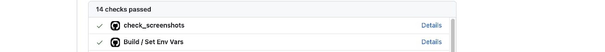

# PR Quality Enforcer 🔍  
_A GitHub Action that ensures PRs include screenshots and follow templates—automatically!_

  
*(Example: PR check in action)*  

## 🚀 Why Use This?  
- **No more blind PRs**: Ensures critical context (screenshots, descriptions) is included.  
- **Zero-config**: Just add the workflow and template.  
- **Customizable**: Adapt to your team’s needs.  

---

## ✨ **Features**  
✅ **Blocks PRs** without screenshots (or warns via comment).  
✅ **Enforces PR templates** for consistent descriptions.  
✅ **Works out-of-the-box** with any GitHub repo.  

---

## 🛠 **Setup (2 Minutes)**  
### 1. Add the Files to Your Repo  
Copy these to your `.github` directory:  
- [`workflows/pr-screenshot-check.yml`](.github/workflows/pr-screenshot-check.yml)  
- [`PULL_REQUEST_TEMPLATE.md`](.github/PULL_REQUEST_TEMPLATE.md)  

### 2. Enable Branch Protection  
Go to:  
**Repo Settings → Branches → Branch Protection Rules → Add Rule**  
- Check _"Require status checks to pass before merging"_  
- Add `pr-screenshot-check` to the list.  

### 3. Done!  
Now, when a PR is opened:  
- If **no screenshot**, the check fails:  
    
- If **screenshot added**, the check passes:  
    

---

## 📝 **Example PR Template**  
```markdown  
### Description  
- [ ] Screenshot attached (drag & drop below)  
- [ ] Changes documented  

**Screenshots**:  
<!-- Add screenshots with `` -->  
